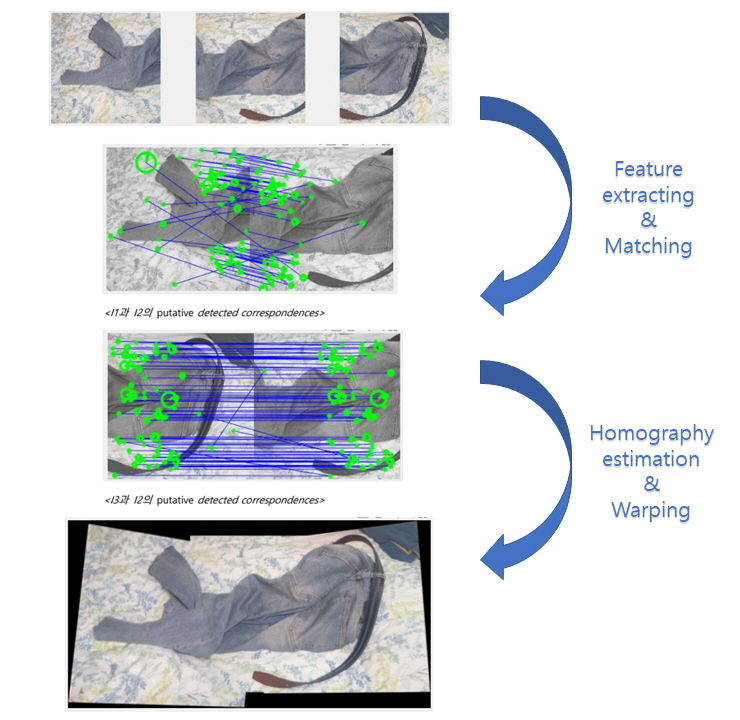
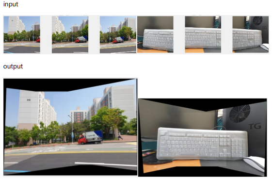

# Image Stiching
**MATLAB** implemention of an image stitching algorithm that automatically stitches multiple images of a scene into a single panoramic image using image warping and homographies

SNU ECE ICV21 Assignment #3

## Overview

The project consists of the following steps:
1. Take three images of a scene with your smartphone camera, rotating the camera to capture different views while maintaining the same center of projection. Resize the images to 256 x 256.
2. Detect feature points in each image using SIFT feature detector,they are distributed over each image.
3. Find putative matches between adjacent images using vl_ubcmatch, and display them as lines or vectors overlaid on the images.
4. Estimate the homography matrix between each pair of adjacent images using RANSAC and DLT.
5. Warp the images using the homography matrices to align them, and stitch them together to create a panoramic image.

## Results

